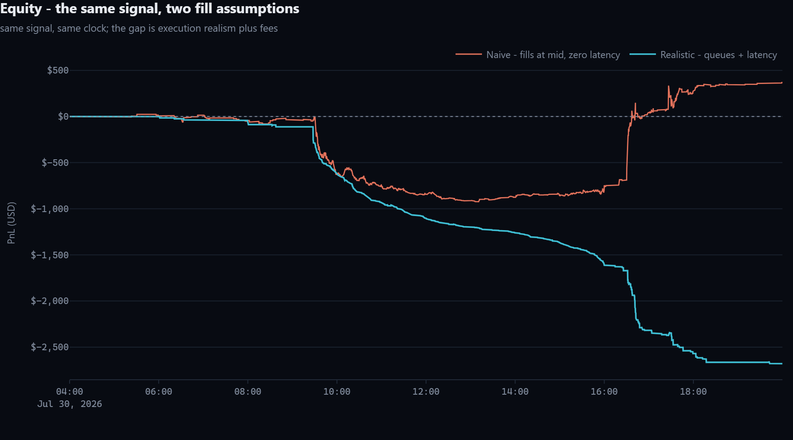
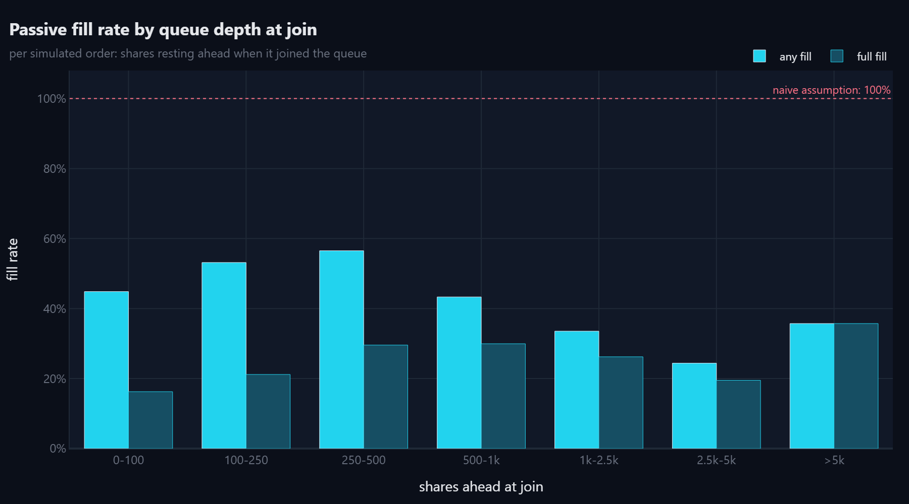
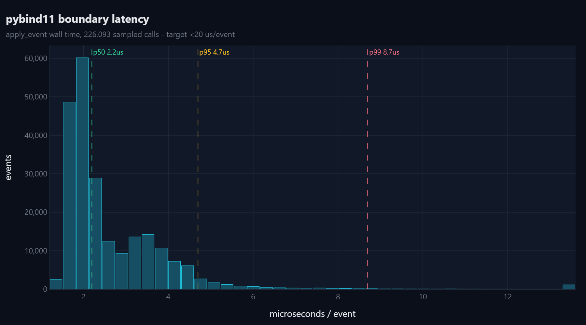
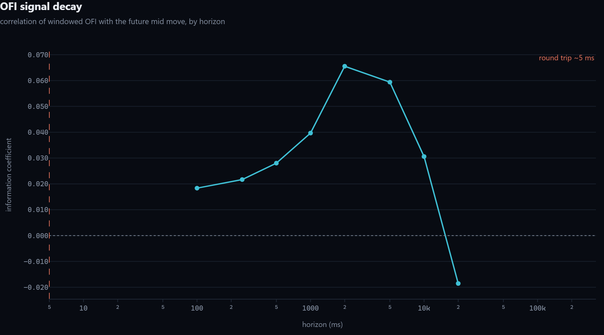
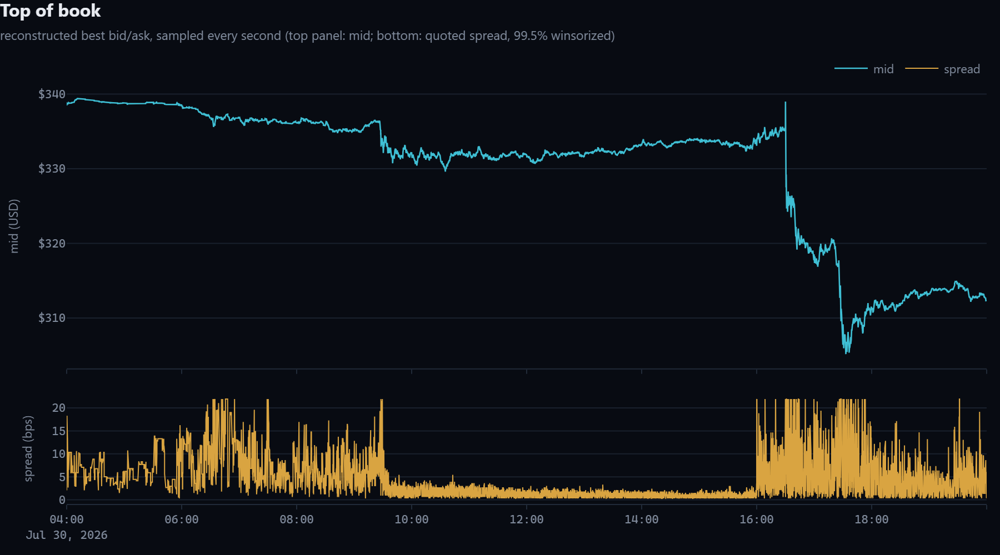

# ITCH-Engine

### C++ Order Book Reconstruction & Latency-Realistic Backtesting Infrastructure (Nasdaq ITCH/MBO)

## Summary

**What data does this use?**
Real Nasdaq exchange data (XNAS.ITCH, the MBO / market-by-order feed) for
one stock, one trading day, pulled live from Databento. Every single order
add, cancel, modify, and execution message that hit the exchange that day,
in order, typically 10-15 million messages for one liquid large-cap stock.
If no Databento API key is configured, the pipeline falls back to a seeded
synthetic day with the same schema, so the whole thing still runs end to
end without a paid data source. The dashboard tells you which mode
produced whatever you're looking at.

**What strategy does it trade?**
A single-feature order flow imbalance (OFI) signal. It watches the best
bid/ask and their sizes, and computes one number each time they change:
is buying pressure or selling pressure building at the top of the book
right now. If that number crosses a threshold, it buys or sells 100 shares
and holds for one second. It is deliberately simple on purpose (see "Why
this project" below) - the point of the project is not the strategy, it's
proving how differently the *same* strategy performs depending on how
honestly you simulate fills.

**How do I run it?**
See "Build & Run" further down for the exact commands. Short version:
build the C++ engine with CMake, run the validation script, run the
backtest script, then `streamlit run viewer/app.py` to see the dashboard.
Everything after the C++ build is plain Python.

**What does this actually prove?**
Two things, independently:

1. The order book reconstruction is *correct*. A second, independently
   written, deliberately simple Python implementation rebuilds the same
   book from the same events, and the two are checked against each other
   at 1,000 random points across the whole day - price levels, order
   counts, and each order's exact position in its queue. Zero mismatches.
   This is a correctness proof, not a benchmark.
2. Backtests that assume instant, complete fills at your target price are
   dangerously optimistic. Running the exact same OFI signal through a
   naive "fills at mid, zero latency" backtest versus an honest one (real
   FIFO order queues, a 2ms data-latency handicap, a 3ms order-latency
   handicap) produces very different results - see the Results section
   below for the actual numbers from a real run.

**Position discipline (and how the engine caught its own bug):**
An earlier version of the strategy could stack exit orders in fast markets
(it could not see its own in-flight orders, so it kept resubmitting exits
sized to the full position), letting the held position balloon far past
the intended 100 shares. The engine's own dashboard exposed this - max
position held is directly visible in the equity data - and the fix is
structural: the strategy sees every outstanding order (in-flight and
resting) and will not enter unless completely flat, nor submit an exit
while another exit is outstanding. On the real-day run below, max position
held is exactly 100 shares, verified from the output data.

---

## One-line pitch
A validated, production-style market data infrastructure stack - real exchange order book reconstruction (proven correct against reference snapshots), an event-driven backtester with realistic fills/latency, a profiled C++/Python hybrid core, and a decoupled static post-trade viewer for presenting results. A trivial ML signal is used only as a test client to demonstrate why naive backtests lie.

## Why this project
The interesting engineering in trading systems is the *infrastructure* strategies run on - and what matters there is correctness and performance, not alpha. This project leads with validation (proving the book is right), then performance (proving it's fast), then uses a deliberately simple signal at the end purely to demonstrate the engine's value. A lightweight visualization layer exists only to present findings clearly - it is explicitly not the focus.

## Scope
Deliberately small and airtight rather than broad:
- **One symbol, one day of data** for the entire project.
- **The signal is intentionally simple** - a single-feature order flow imbalance predictor. Its job is to produce one comparison number, not to be impressive on its own.
- **The dashboard is intentionally minimal** - a static-file reader over the backtester's outputs.
- **Validation is the core deliverable.** Everything else - including the visualization layer - is in service of proving the book is correct and the engine is fast.

---

## Tech Stack
- **Core engine:** C++ (order book data structure, matching/fill logic) - industry-standard for performance-critical quant infra
- **Bindings:** pybind11 (C++ ↔ Python)
- **Orchestration / analysis:** Python (event loop, signal logic, backtest reporting)
- **Data storage:** Parquet (columnar, point-in-time correct, partitioned by symbol/day)
- **Data source:** Databento - `XNAS.ITCH` (Nasdaq TotalView-ITCH) MBO (Market-By-Order) feed, free-tier credits
- **Profiling:** perf / gprof (or equivalent) for hot-path optimization
- **Streamlit (or Plotly) for static post-trade analysis visualization** - reads only the files the backtester writes to disk; never touches the live engine

---

## Architecture Overview

```
Databento (XNAS.ITCH MBO) - ONE symbol, ONE day
        │
        ▼
[Phase 1] Data Ingestion & Normalization
   - Pull raw MBO messages, save raw Parquet immediately (preserve credits)
   - Normalize → internal schema (timestamp, order_id, side, price, qty, event_type)
   - Partitioned by symbol/date even at 1-day scale (production-style, not a hack)
        │
        ▼
[Phase 2] C++ Order Book Engine + VALIDATION (the real deliverable)
   - Price-level aggregation + per-order FIFO queue (true queue position)
   - Data structure choice justified explicitly (see below)
   - Validation script: C++ book state vs. Databento reference snapshot
     at 1,000 random timestamps → assert 0 drift → green PASS screenshot in README
        │
        ▼
[Phase 3] Event-Driven Backtester (pure while event_queue loop - never vectorized)
   - Latency model: strategy sees data N ms late
   - Queue-position-aware partial fills
   - Profile the Python↔C++ boundary explicitly (pybind11 copy overhead is the
     usual hidden bottleneck) - target <20µs/event at that boundary
        │
        ▼
[Phase 4] Trivial ML Signal as Test Client (deliberately small)
   - Single-feature order flow imbalance (OFI) predicting next 1s mid-price move
   - Run through naive vectorized backtest AND the realistic engine
   - Headline result: how much of the apparent edge was a fill-assumption artifact
        │
        ▼
[Backtester writes to disk] trades.csv, metrics.json, snapshots.parquet
        │
        ▼
[Phase 5] Post-Trade Visualization & Reporting (fully decoupled, static-file reader)
   - Lightweight Streamlit/Plotly app reads ONLY the files above
   - Never connects to the live C++ engine or event loop - zero latency interference
   - 4-5 charts: Equity Curve, Latency Histogram, Fill-Rate by Queue Position, Signal Decay
   - FAILURE_MODES.md - the lead artifact, written first in spirit even if last in code
```

---

## Phase Breakdown

### Phase 1 - Data Ingestion (small and disposable)
- Pull 1 day of MBO data for one liquid large-cap symbol (e.g., AAPL or SPY)
- Save raw pull locally as Parquet immediately
- Normalize into internal schema; partition by symbol/date
- **Deliverable:** script that replays the stored day tick-by-tick and reconstructs book state at any timestamp

### Phase 2 - C++ Order Book Engine + Validation
- Limit order book: price-level aggregation + per-order FIFO queue
- **Data structure decision:** a naive `std::vector<OrderID>` per price level makes cancel-in-the-middle an O(N) operation. This book uses `std::list` with stored iterators so cancel/modify is O(1) - the full argument is in [docs/data_structure_tradeoffs.md](docs/data_structure_tradeoffs.md).
- Exposed to Python via pybind11
- **Deliverable (the one that matters most):** a validation script asserting exact agreement between the C++ book and an independent reference implementation at 1,000 random timestamps, 0 drift. The PASS output is reproduced in the Results section below.

### Phase 3 - Event-Driven Backtester
- True event loop calling into the C++ book - no `pandas.apply`, no vectorization, anywhere
- Latency model: strategy sees data N ms late; queue-position-aware partial fills; slippage tied to real book depth
- **The pybind11 boundary is profiled specifically** - µs/event crossing Python↔C++, not just internal C++ speed. This is the usual hidden bottleneck in hybrid systems.
- **Deliverable:** run a simple strategy through it and quantify fill realism vs. a naive "fills at mid" backtest
- Backtester writes its outputs to disk (`trades.csv`, `metrics.json`, `snapshots.parquet`) - this is the handoff point to Phase 5, and the only handoff point. No other component reads or writes these files.

### Phase 4 - Test-Client Signal (kept deliberately small)
- One-feature OFI predictor of the next 1-second mid-price move - nothing more elaborate
- Run through both the naive vectorized backtest and the realistic engine
- **Deliverable / thesis statement:** how much of the signal's apparent alpha was an artifact of unrealistic fill assumptions rather than real edge. See the Results section for the measured answer.

### Phase 5 - Post-Trade Visualization & Reporting
This phase exists to **present** the findings from Phases 2-4 clearly. It is explicitly **not** a production monitoring system, and it is **not** where the engineering effort of this project lives. Validation (Phase 2) and latency profiling (Phase 3) remain the headline deliverables; this is packaging.

Hard boundaries on this layer, by design:
- **Strictly a decoupled, static-file reader.** It reads `trades.csv`, `metrics.json`, and `snapshots.parquet` from disk - the same files Phase 3 already writes. Nothing more.
- **Never connects to the live C++ engine or the event loop, under any circumstance.** UI rendering is completely separated from the performance-critical path. This is intentional: a backtester that produces analysis files and a viewer that reads them afterward is a real production pattern; a UI wired into a live engine is a latency liability and architecturally the wrong call for this kind of tool. Decoupling here is the point being demonstrated.
- **No websockets, no real-time updates, no complex state management.** Streamlit and Plotly, rendering static charts from static files.
- **A handful of charts, no more:** Equity Curve, Top of Book, Fill-Rate by Queue Position, Signal Decay, Latency Histogram.

Also in this phase:
- Profile the C++ core, document before/after latency from any optimization
- Static JSON output: latency percentiles (p50/p95/p99), fill rates
- A handful of plotly-rendered PNGs embedded in the README (so the README doesn't depend on anyone running the Streamlit app)
- **`FAILURE_MODES.md` at repo root** - 2 focused sections: why queue position matters, why delayed data kills momentum-style signals - both written from this engine's own measured output.

---

## Build & Run

Prereqs: CMake >=3.20, a C++17 compiler (MSVC/GCC/Clang), Python 3.9+ with
the requirements installed. pybind11 is located automatically from the
Python environment, so no extra CMake flags are needed beyond the ones
shown.

On Windows, use `py -3.9` wherever these commands say `python`, and
`py -3.9 -m pip` for `pip` (the plain names are often not on PATH). Run
the CMake commands from an "x64 Native Tools Command Prompt for VS" so the
MSVC compiler is available.

Windows (copy-paste as-is, from the repo root):

```bash
py -3.9 -m pip install -r python/requirements.txt
```

```bash
cmake -S . -B build -G Ninja -DCMAKE_BUILD_TYPE=Release -DPYBIND11_FINDPYTHON=ON -DPython_EXECUTABLE="%LOCALAPPDATA%\Programs\Python\Python39\python.exe"
```

(The `Python_EXECUTABLE` pin makes CMake build against the same Python
that runs the scripts; without it, CMake may pick a different installed
Python, such as a Conda one, and the module will not import.)

```bash
cmake --build build
```

```bash
build\cpp\test_order_book.exe
```

```bash
py -3.9 validation/validate_book.py
```

```bash
py -3.9 scripts/run_backtest.py
```

```bash
py -3.9 profiling/profile_pybind_boundary.py
```

```bash
py -3.9 -m streamlit run viewer/app.py
```

Linux/macOS equivalents:

```bash
pip install -r python/requirements.txt
cmake -S . -B build -DCMAKE_BUILD_TYPE=Release -DPYBIND11_FINDPYTHON=ON
cmake --build build
./build/cpp/test_order_book
python validation/validate_book.py
python scripts/run_backtest.py          # --rth-only restricts to 09:30-16:00 ET
python profiling/profile_pybind_boundary.py
streamlit run viewer/app.py
```

Step order matters: build first, then validation (ingests data on first
run; synthetic unless `DATABENTO_API_KEY` is set), then the backtest
(writes `output/`), then the viewer (reads `output/`).

Without a Databento key, ingestion generates a seeded, schema-identical
synthetic MBO day so every phase runs end-to-end; with
`DATABENTO_API_KEY` set (and `pip install databento`), the same commands
pull and cache one real XNAS.ITCH day. The results below are from real data.

### Pulling a new day, and what happens to old data

Step-by-step Windows commands (including API key setup):
[docs/PULLING_DATA.md](docs/PULLING_DATA.md).

Pull + normalize a day on its own (prints the record count and dollar cost
first if `DATABENTO_API_KEY` is set, and asks for confirmation before
spending credits), then run the pipeline on it:

```bash
py -3.9 scripts/pull_day.py --symbol AAPL --day 2026-08-03
```

```bash
py -3.9 scripts/run_backtest.py --symbol AAPL --day 2026-08-03
```

Nothing is deleted automatically. Every day you pull is cached forever in
its own folder (`data/raw/symbol=X/date=Y/`, `data/processed/symbol=X/
date=Y/`), so pulling a new day never touches an older one - they just
accumulate on disk. `output/` (the three files the viewer reads) is the one
exception: it is a single, unpartitioned location by design, so each new
backtest run overwrites the previous one's results. To avoid silently
losing a day's results, `write_outputs()` automatically archives the
existing `output/` into `output_archive/<symbol>_<day>_<timestamp>/`
before overwriting it.

See what's cached and how much disk it's using (never deletes anything):

```bash
py -3.9 scripts/cleanup_data.py
```

Reclaim space, keeping only the most recent day per symbol:

```bash
py -3.9 scripts/cleanup_data.py --keep-latest 1 --delete
```

Delete one specific cached day:

```bash
py -3.9 scripts/cleanup_data.py --symbol AAPL --day 2026-07-01 --delete
```

Prune old `output_archive/` snapshots, keeping the 3 most recent:

```bash
py -3.9 scripts/cleanup_data.py --archives --keep-latest 3 --delete
```

## Results (real XNAS.ITCH MBO: AAPL, 2026-07-30, 14.47M events)

**Validation - the deliverable that matters most** (`validation/results/validation_run.txt`):

```
symbol=AAPL day=2026-07-30
events replayed: 14,469,899
checkpoints: 1,000 random timestamps
assertions: 8,000
mismatches: 0
RESULT: PASS - 0 drift across all sampled timestamps
```

Checked at every checkpoint, against an independently implemented Python
reference book: top-5 levels per side (price/qty/order count), best quotes,
open order count, and exact FIFO `queue_ahead` for sampled live orders.
(~1.3% of feed messages reference orders resting from before the session
window; both books handle them identically and count them - see
`unknown_order_events` in metrics.json.)

**Boundary profiling** (`profiling/results/latency_percentiles.json`):
`apply_event` 3.79 µs/event mean (p50 3.3, p99 11.2) - **<20 µs target
met** with 5x headroom; batch replay 0.60 µs/event (**~1.68M events/s**
through the C++ book); ~84% of the scalar cost is the pybind11 crossing
itself, not book work.

**Headline result:** the naive vectorized backtest of the OFI signal shows
**+$293** on the day; the identical signal through queue-position fills and
a 2ms/3ms latency model shows **-$2,311**. The naive backtest didn't just
overstate the edge - it got the *sign* wrong: all of the apparent alpha was
a fill-assumption artifact sitting on top of steady adverse selection
(~2 cents/share lost across 3,672 fills and 116,884 shares against real
HFT flow, with no single episode dominating - the worst one-second equity
step is under $100). Passive fill rate was ~47% vs the naive assumption of
100%, and the fills received were disproportionately the
adversely-selected ones. Position discipline is enforced and verified: max
position held all day was exactly the intended 100 shares.
(`scripts/run_backtest.py --rth-only` additionally restricts trading to
regular hours, 09:30-16:00 ET, if you want to exclude pre/post-market.)
Full argument: [FAILURE_MODES.md](FAILURE_MODES.md).



| | |
|---|---|
|  |  |
|  |  |

---

## Design Highlights
- **Validation-first** - the order book is proven correct (0 drift against an independent reference implementation across 1,000 sampled timestamps on real data) before anything is built on top of it
- **Real exchange-native data** - XNAS.ITCH MBO via Databento, with all the real-feed messiness handled explicitly (session-boundary orders, cancel-dominated message mix)
- **C++/Python hybrid with the boundary measured** - the pybind11 crossing is profiled per event, not assumed fast
- **Explicit data-structure reasoning** - O(1) cancel/modify via list-iterator indexing, justified against the actual message mix in [docs/data_structure_tradeoffs.md](docs/data_structure_tradeoffs.md)
- **Quantified realism gap** - the same signal run through naive and realistic fill assumptions, with the difference measured rather than hand-waved
- **Decoupled post-trade layer** - the viewer reads static output files only and never touches the engine, keeping analysis off the performance-critical path
- **[FAILURE_MODES.md](FAILURE_MODES.md)** - the two ways backtests lie, written from this engine's own measured output

## Project Status
- [x] Ingestion: real XNAS.ITCH day pulled, cached, and normalized (14.47M MBO events); synthetic fallback for keyless runs
- [x] C++ order book + validation: 0 drift across 1,000 random checkpoints (8,000 assertions) on real data
- [x] Event-driven backtester with two-book latency model, queue-aware fills, and structural position discipline
- [x] pybind11 boundary profiled: 3.79 µs/event scalar (0.60 µs batched), <20 µs target met
- [x] OFI test client: naive backtest reversed the PnL sign vs the realistic engine (+$293 vs -$2,311)
- [x] Streamlit viewer + README chart PNGs (`scripts/export_charts.py`)
- [ ] Possible extensions: more symbols/days, an intrusive-list book variant, a C++ fill model for full-speed strategy sweeps
